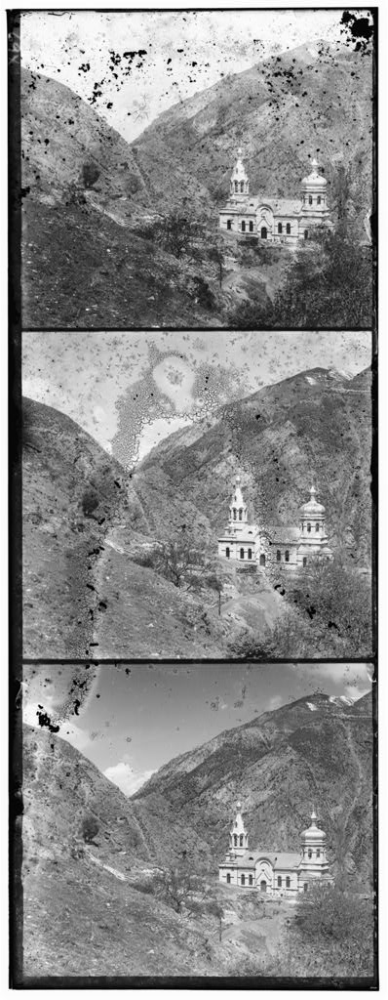
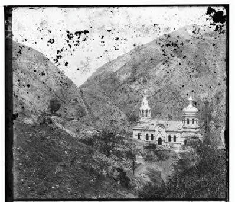
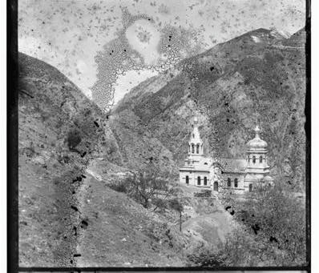
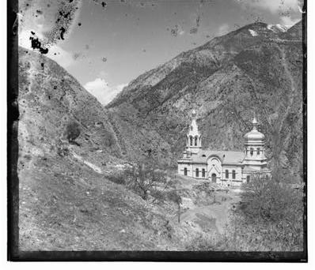
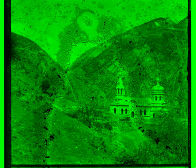
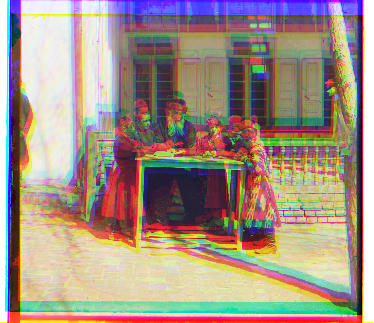
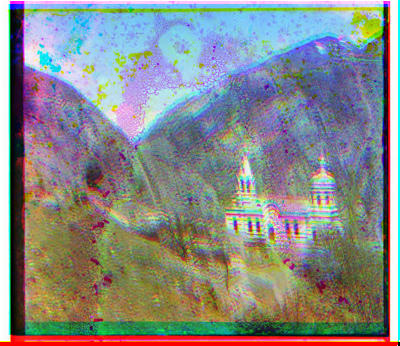
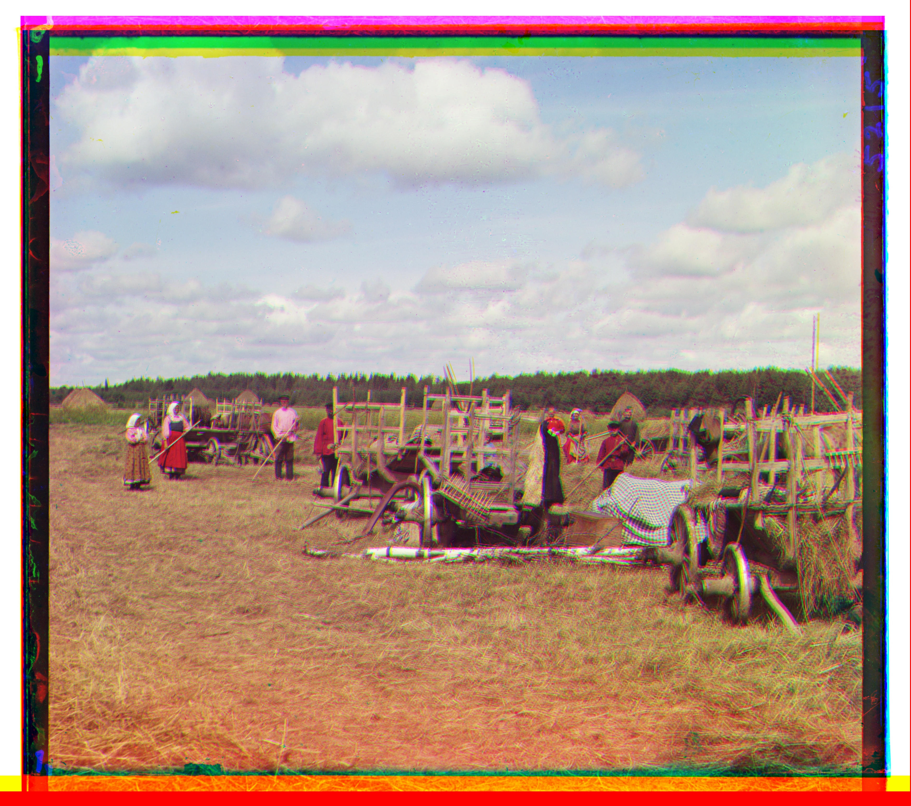

- [Aligning and compositing the Prokudin-Gorskii collection](#sec-1)
  - [Why Rust?](#sec-1-1)
    - [Photon](#sec-1-1-1)
  - [Loading images and their important data](#sec-1-2)
  - [Basic Overlaying](#sec-1-3)
  - [First Alignment Algorithm Attempt](#sec-1-4)
    - [RGB vs Luma](#sec-1-4-1)
    - [Brute force](#sec-1-4-2)
  - [Algorithm 2: Need for Speed](#sec-1-5)

# Aligning and compositing the Prokudin-Gorskii collection<a id="sec-1"></a>

The [Prokudin-Gorskii](<http://www.loc.gov/exhibits/empire/gorskii.html>) Collection is a set of photos from the 1800s by the Russian photographer Sergei Mikhailovich Prokudin-Gorskii. They were some of the first color photos, created by taking the same photos with red, green, and blue filters. This means to see them in actual color, we must overlay all three images, after converting them to red, green, and blue scale images.

## Why Rust?<a id="sec-1-1"></a>

Rust is fast, like really fast. The reason being is it's a thin layer on top of the computer (or metal, hence "Rust"), and although the compilations take forever, the reason is it ends up being equivalent to C in speed. Unlike C though, there's a lot of easy to install libraries, with a package manager akin to python's. So we get the speed of C, but the useful libraries of python, and although most python libraries are in C, using them to that level of speed requires careful consideration and reading. Rust on the other hand, if you can get it to compile it'll be incredibly fast by default.

### Photon<a id="sec-1-1-1"></a>

[Photon](<https://github.com/silvia-odwyer/photon>) is the image processing library used here, as it's pretty complete with standard image operations such as crop resizing and color manipulation, and a pretty simple API.

## Loading images and their important data<a id="sec-1-2"></a>

Opening an image is pretty simple:

```rust
use photon_rs::native::{open_image, save_image};

fn main() -> Result<(), Box<dyn std::error::Error>> {
    // Open the image (a PhotonImage is returned)
    let mut img = open_image("test_image.PNG")?;
    // Write file to filesystem.
    save_image(img, "raw_image.JPG")?;

   Ok(())
}
```

`PhotonImage` is the base image class, and what we'll use to pass around and manipulate the image with one exception, when we want pixel by pixel access. To do this we convert the image to a vector of \`Pixel\`s, a handy data structure than can represent a pixel in any kind of color type.

Getting the pixels:

```rust
let img = /*...*/;
let pixels = dyn_image_from_raw(img); // Get the pixels as a vector
for p in pixels{
    let x = p.0; // X Coord
    let y = p.1; // Y Coord
    let channels = p.2.channels(); // Color channels, by defaul Rgba
    /* Do something fancy */
}
```

## Basic Overlaying<a id="sec-1-3"></a>

We see that the images provided in <./data> come in a slightly strange format. All three "channels" or images are in one image, and are ordered B-G-R from top to bottom:



This means the first step is to extract all three images into their own respective \`PhotonImage\`'s. Luckily, they are space equidistant, so if we split the image in thirds that'll be enough.

```rust
let width = img.get_width();
let height = img.get_height();
let b_channel = crop(&mut img, 0, 0, width, height / 3); // first third
let g_channel = crop(&mut img, 0, height / 3, width, 2 * height / 3); // second third
let r_channel = crop(&mut img, 0, 2 * height / 3, width, 3 * height / 3); // last third
```

Which results in:







Great, but we have no real way to overlay them, since a gray scale image has all channels equal to the brightness of the pixel, so overlaying them doesn't mean anything. The next step is to "color" each photo, which really means setting the G and B channels of the red photo to zero, but leave it's red channel alone. This works as filters were used when the photo was taken, so we know that in the red image anything red will be bright, and all other colors will be very dim, since they're absorbed by the filter.

```rust
// Take in an image, and which channel we want it to be
fn reverse_grayscale(photon_image: &mut PhotonImage, channel: usize) {
    // alter_XXX_channel takes an image and adds the value passed to the
    //respective channel bounded by [0,255]
    if channel != 0 {
        alter_red_channel(photon_image, -255);
    }
    if channel != 1 {
        alter_green_channel(photon_image, -255);
    }
    if channel != 2 {
        alter_blue_channel(photon_image, -255);
    }
}
```

Now if we look at the images we see we have what feels like something closer to a color image:





Finally, we want to overlay the images, which means for a pixel at `x,y`, we want it's red, blue, and green channels equal to the red green and blue values of the images above at the same location. This means we need pixel by pixel alterations, so we'll have to use the method described above in the Photon section:

```rust
fn component_overlay(pi_a: &PhotonImage, pi_b: &PhotonImage) -> PhotonImage {
    let mut img_a = dyn_image_from_raw(pi_a);
    let img_b = dyn_image_from_raw(pi_b);
    let img_a_pixels = img_a.clone();
    let pixels_a = img_a_pixels.pixels();
    let img_b_pixels = img_b;
    let pixels_b = img_b_pixels.pixels();
    pixels_a // join the pixels of both images into a tuple
        .into_iter()
        .zip(pixels_b.into_iter())
        .for_each(|(mut a, b)| { // for each pair
            // set the channel to the sum, clamp bounds the addition to [0,255]
            a.2.channels_mut()[0] =
                (a.2.channels_mut()[0] as u16 + b.2.channels()[0] as u16).clamp(0, 255) as u8;
            a.2.channels_mut()[1] =
                (a.2.channels_mut()[1] as u16 + b.2.channels()[1] as u16).clamp(0, 255) as u8;
            a.2.channels_mut()[2] =
                (a.2.channels_mut()[2] as u16 + b.2.channels()[2] as u16).clamp(0, 255) as u8;
            img_a.put_pixel(a.0, a.1, a.2);
        });
    // Convert back to the image
    let raw_pixels = img_a.to_bytes();
    PhotonImage::new(raw_pixels, pi_a.get_width(), pi_a.get_height())
}
```

This seems perfect for our solution, except for one thing, what if the images aren't the same size? We said earlier they were, so this should work if we used it, but we'll soon see that the default overlap won't be perfect, and we'll need to shift the images. To do this we'll have to add a margin to the left and right, meaning the images will be different sizes. We could just add a margin to either side, but to do so we want to make sure we're doing it to the smaller image first:

```rust
fn overlay(mut pi_a: PhotonImage, mut pi_b: PhotonImage) -> PhotonImage {
    // Swap them first, so b is smallest
    if pi_a.get_width() < pi_b.get_width() {
        std::mem::swap(&mut pi_a, &mut pi_b);
    }
    let b_x_pad = pi_a.get_width() - pi_b.get_width();
    // Add margin to the right
    let mut pi_b = padding_right(&pi_b, b_x_pad, Rgba::new(0, 0, 0, 0));

    // Same as before but height
    if pi_a.get_height() < pi_b.get_height() {
        std::mem::swap(&mut pi_a, &mut pi_b);
    }
    let b_y_pad = pi_a.get_height() - pi_b.get_height();
    // Add margin to bottom
    let pi_b = padding_bottom(&pi_b, b_y_pad, Rgba::new(0, 0, 0, 0));
    // Now call previous overlay function
    component_overlay(&pi_a, &pi_b)
}
```

Let's look at the result:



It looks pretty good! At least compared to the original image. If we look at the spire of the cathedral though, we see a distinct red and green shadow. Looking along the skyline, we see a blue shadow. Instantly we can tell there's a better alignment.

## First Alignment Algorithm Attempt<a id="sec-1-4"></a>

In order to align the images, we need some sort of metric. Normalized Cross Correlation is a common choice for this process: `dot( image1./||image1||, image2./||image2|| )`, but an important question is on what part of the image? We can do this for all of the channels, but they're different colors, so it feels as though that may not have much meaning, as only the red channel will effect the red NCC, and so on. We also don't expect that if we compare just the non-zero channels, that the result will be completely accurate, since they are different colors after all.

### RGB vs Luma<a id="sec-1-4-1"></a>

RGB is the color scheme that corresponds to the amount of red green and blue in the single pixel. Luma was the color scheme I chose to use over RGB for comparing images, as it represent the weighted sum of red green and blue, or a good approximation of not luminance, which is the brightness according to humans, but the "colorimetric" luminance, which is the luminance relative to other colors. For example a red and blue may seem the same luminance, or brightness to the human eye, but in reality they could be dissimilar absolutely, since for example we might see a blue and green mixture as brighter than red and blue of the same values, even though their luma is the same. This made sense to me as a better metric for comparing gray scale images, as we want to focus on the differences between the brightness's of the objects, not their perceived colors.

Putting this altogether we get for our difference:

```rust
fn difference(pi_a: &PhotonImage, pi_b: &PhotonImage) -> f64 {
    let pixels_a = dyn_image_from_raw(pi_a);
    let pixels_a = pixels_a.pixels(); // pixels of first
    let pixels_b = dyn_image_from_raw(pi_b);
    let pixels_b = pixels_b.pixels(); // Pixels of 2nd image
    let (a, b, c) = pixels_a
        .into_iter()
        .zip(pixels_b.into_iter())
        .map(|((_, _, a), (_, _, b))| {
            let b = b.to_luma(); // Get luma of a
            let a = a.to_luma(); // Get luma of b
            let b = b.channels()[0] as f64;
            let a = a.channels()[0] as f64;
            // dot product, sum of square of a, sum of square of b
            (a * b, a.powf(2.0), b.powf(2.0))
        })
        .fold((0.0, 0.0, 0.0), |(x, y, z), (a, b, c)| {
            (x + a, b + y, z + c)
        });
    // dot product over the norm of a * norm of b
    a / (b.sqrt() * c.sqrt())
}
```

And we see that if we apply this to our image above, we get the result of ~ 0.89 or 89% where we want as close to 100% of a match as possible. Granted that won't be possible since as one can see the image has a lot of irregular noise between the channels.

### Brute force<a id="sec-1-4-2"></a>

Now that we have a metric, we have a way to compare the images to see if we've found a better overlap, we can start by brute force checking possible translations:

```rust
fn brute_force(
    pi_a: PhotonImage,
    pi_b: PhotonImage,
    channels: Channels,
    search_radius: i32,
    side:bool,
) -> (PhotonImage, PhotonImage, f32) {
    let mut best = 0.0;
    let mut best_a = pi_a.clone();
    let mut best_b = pi_b.clone();
    let mut best_p = 0.0;
    for y in (-search_radius)..search_radius {
        let (pi_a_pad, pi_b_pad, diff) = pad_and_diff(y, channels, &pi_a, &pi_b,side);
        if diff > best {
            best = diff;
            best_a = pi_a_pad;
            best_b = pi_b_pad;
            best_p = y as f32;
        }
    }
    (best_a, best_b, best_p)
}
```

Here we see that the code is luckily pretty simple. `pad_and_diff` is simply a function that combines the padding function, which simply adds margin to the side determined by `side`, and then finds the difference between the two photos we're overlaying as described before. When running this through the difference checker, we get ~92% as our result, which is much better numerically. Visually, it's a night and day difference:



As far as time goes for the vector calculations, we're in the microseconds, so that's not an issue. When trying a larger image though (see: ) we end taking a few minutes per layer per x or y coordinate. That's pretty unfortunate, but it's ok because the next section will focus on speed.

## Algorithm 2: Need for Speed<a id="sec-1-5"></a>

We used one major way to speed up the algorithm: gradient descent. The formula for it is pretty simple: $a_{n+1} = a_n - \Delta \cdot \frac{dx}{dy}(f)$ where $a_n$ is some iteration of the output, in our case the padding value, $\Delta$ is the "learning" factor, or how fast we're changing our guesses. Finally the derivative is the gradient, or the rate of change of our function. The goal of this is to minimize $a_n$, or essentially the difference of the two images. A big catch here is that we don't have a good derivative for NCC. I tried to find one but couldn't at least. We can approximate this though, by choosing some image slightly more shifted than the current one, and then taking the average.

```rust
fn gradient_descent(
    pi_a: PhotonImage,
    pi_b: PhotonImage,
    channels: Channels,
    delta: f64,
    mut epsilon: f64,
    side:bool
) -> (PhotonImage, PhotonImage, f32) {
    /*Init variables ...*/
    for _ in 1..300 {
        let (pi_a_pad, pi_b_pad, diff) = pad_and_diff((padding) as i32, channels, &pi_a, &pi_b,side);
        let (_, _, diff_p) = pad_and_diff((padding + epsilon) as i32, channels, &pi_a, &pi_b,side);
        //invert so we're minimizing the difference
        let diff = 1.0 - diff;
        let diff_p = 1.0 - diff_p;
        let mut gradient = delta * ((diff - diff_p) / epsilon);
        let sign = gradient / gradient.abs();

        if gradient.abs() >= 1.0 {
            // Logarithm of the gradient
            gradient = gradient.abs().log2() * sign;
        }
        //Round it since we only care about some accuracy
        gradient = (gradient * 100.0).trunc() / 100.0;
        // Make sure we don't keep reusing small gradients that we don't care about
        if seen.contains(&(gradient as i32)) {
            seen_cnt += 1;
        } else {
            seen_cnt = 0;
        }
        seen.push_back(gradient as i32);
        if seen.len() > 10 {
            seen.pop_front();
        }
        padding += gradient;
        if seen_cnt > 4 {
            delta /= 10.0;
        }
        if epsilon > gradient {
            epsilon/=1.1;
        }
        // Keep the best
        if diff < best {
            best = diff;
            pi_a_pad_final = pi_a_pad;
            pi_b_pad_final = pi_b_pad;
            best_pad = padding
        }
        if gradient.abs() < 0.01 {
            return (pi_a_pad_final, pi_b_pad_final, best_pad as f32);
        }
    }
    (pi_a_pad_final, pi_b_pad_final, best_pad as f32)
}
```

Getting gradient descent to work was by far the hardest part of this project, as I've never done it before, so I struggled to understand tuning the parameters, both dynamically and by hand. For example, I found that the gradient worked best when I took the log of the function, as it'd smooth it out. Another modification that helped was that changing $\epsilon$, or the parameter used for the gradient, by scaling it down helped when the differences would jump around, i.e. we'd go from 80% match to 90% match, and the gradient would be -5 and 5 respectively for each one, meaning that it'd jump back and forth between the two.

Another major speed bump came from using [cached](<https://github.com/jaemk/cached>), which is a function annotation that will memoize and function. Hence why the `pad_and_diff` function was created, so it could be annotated and return the difference if it detected that the same images with the same padding were being compared again.

As far as speed goes, this gave an immense speed up in two ways. The first way is that we can obviously simply skip trying a bunch of options, to the point where with the smaller images, it'd usually guess the offset in around 2-3 iterations, meaning a speedup of 5x. The other way it'd speed up computation is that we could give this algorithm a scaled down image, and since the formula result is in decimal, when we rescaled the resulting calculation, it'd be accurate for the larger images. For example it may say a shift value of the scaled down image is 7.53, but when scaled up that'd correlate to 75.3 pixels, which means we're losing less information due to scaling than if we used the brute force method with scaling.

All together the speedups made a huge difference. First, brute forcing a single large image (01007a.jpg) took three hours and twenty minutes, while the gradient descent method without caching took seventeen minutes. With caching, depending on the parameters, took between three to five minutes. That was fantastic, as it made debugging a much shorter process, and testing different values easier too. As far as visual results go, the brute force method and the gradient descent method were indistinguishable for the smaller images, and neither were the larger images. There's a caveat there though, as I only ran one brute force trial, due to the length, and used a relatively small area to check. Namely a 50x50 area, meaning 2500 different possible combinations, per pair of channels. We see the speed up is clear there too, as per pair of layers, the maximum number of iterations was around 50 for large images, usually reaching the target in less than that (around 30), but my cutoff for stopping wasn't fleshed out that well, so it would hop back and forth between two similar values for a dozen or so iterations. The cutoff function is another thing I would improve if I approached this project again.

The result of the brute force method was also not very satisfactory as later on I realized I had a major issue with my difference code. Photon-rs returns a vector of pixels, but only a one dimensional one. This means that if the cropping of the slides weren't exactly correct, we'd essentially end up with a shifted comparison, where the first row was accurate, but then the next would be slightly off, so on and so forth. This wasn't the only error of this kind, as I would adjust the positioning of the images by adding a white margin to the left or top accordingly. Since this would also change the shape of the images, and the vector was one dimensional, this would introduce a similar error. Eventually I realized this, and updated the code to add margins to the right and bottom, which helped this significantly. One issue I never managed to figure out, was what color to choose for the margins, as they would contribute to the difference analysis. If I were to reattempt this project, I think I would either add a way to offset what part of the image the difference is taken from, or I would use say a completely transparent margin, with an alpha channel value of 0 as the margin, and then just skip those pixels if the pixel from each image is margin.

If we look at this image, specifically the vertical alignment of the green channel:



We see the major drawback of the gradient descent method, or at least my implementation of it. With small images, we usually get the exact same displacement vector as the brute force method, in only one or two iterations instead of 225 (15x15), but larger images seem to always run into a valley, or a local minimum, a section of the image where moving by the displacement factor would decrease image similarity, but if it moved a significant distance it would be an improvement. The second issue would be precision, as the difference for a large image between where it is and a few pixels over isn't even a thousandth of a percent of the image, but still is visible. This is what we're seeing in this image, as the green channel is slightly off, but the log of the algorithm showed that moving a few more pixels as needed didn't produce a significant difference, specifically less than 0.01%. If I were to re approach this issue, I would most likely combine the brute force and gradient descent methods, using the gradient descent to get near an area, and then only brute force a small 10x10 area for the final alignment. Another possibility would be to brute force a small area for the current displacement, and then the displacement the gradient chose, and to use that to calculate the next step, as then we'd have a better picture of what moving in a certain direction looked like.

All images can be found in <./data/processed>. Below are the vectors used:

| Vectors                           | File            |
|--------------------------------- |--------------- |
| rg [3,-2] rb [1,-1] gb [1,-1]     | data/00056v.jpg |
| rg [3,-1] rb [6,0] gb [5,-1]      | data/00125v.jpg |
| rg [0,0] rb [1,-2] gb [0,0]       | data/00163v.jpg |
| rg [1,0] rb [7,-1] gb [0,0]       | data/00804v.jpg |
| rg [2,-2] rb [5,-2] gb [2,-2]     | data/01164v.jpg |
| rg [4,-2] rb [3,-1] gb [3,-4]     | data/01269v.jpg |
| rg [4,-2] rb [7,0] gb [6,0]       | data/01522v.jpg |
| rg [2,-1] rb [11,0] gb [7,0]      | data/01597v.jpg |
| rg [3,-1] rb [3,-3] gb [0,0]      | data/01598v.jpg |
| rg [7,-1] rb [4,-1] gb [4,0]      | data/01728v.jpg |
| rg [0,0] rb [4,0] gb [1,0]        | data/10131v.jpg |
| rg [1,-3] rb [1,-5] gb [2,-1]     | data/31421v.jpg |
| rg [44,28] rb [20,31] gb [-26,26] | data/00458u.jpg |
| rg [85,0] rb [41,4] gb [66,0]     | data/01007a.jpg |
| rg [72,18] rb [-33,4] gb [29,17]  | data/01047u.jpg |
| rg [146,9] rb [-10,10] gb [67,-6] | data/01725u.jpg |
| rg [22,-10] rb [120,10] gb [62,4] | data/01861a.jpg |
